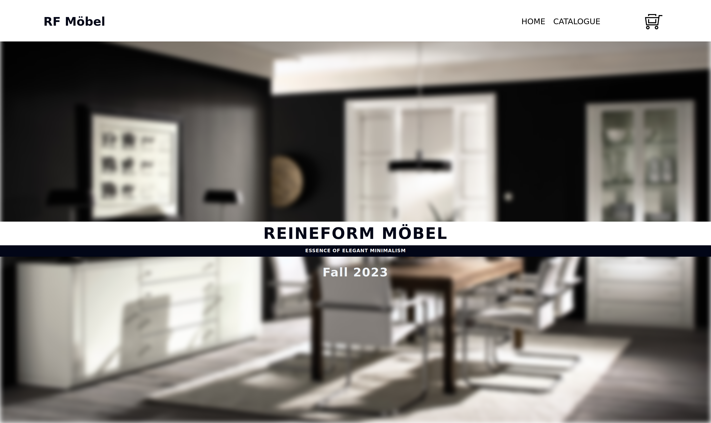
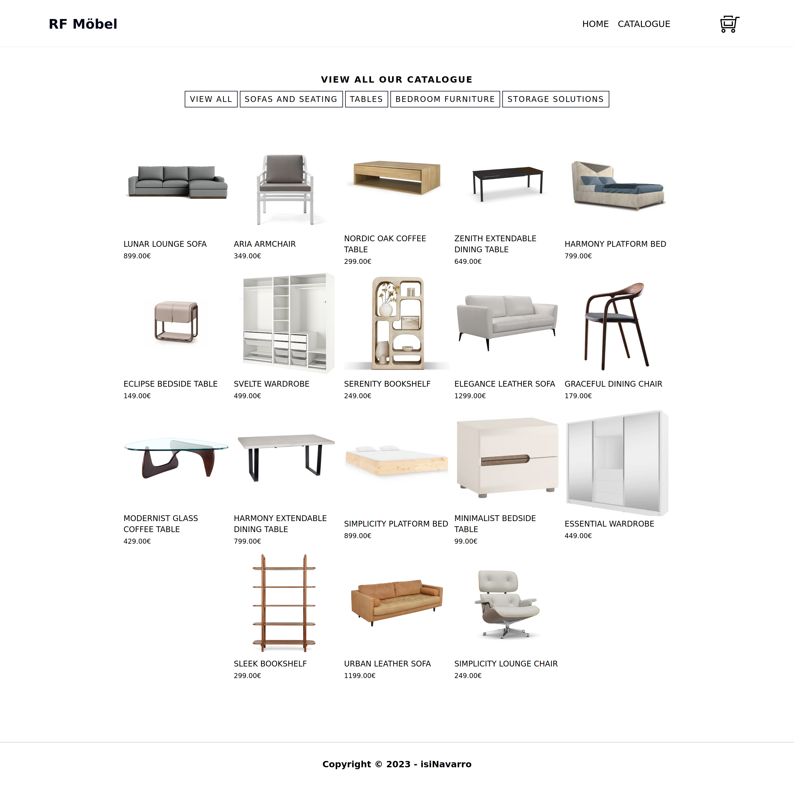
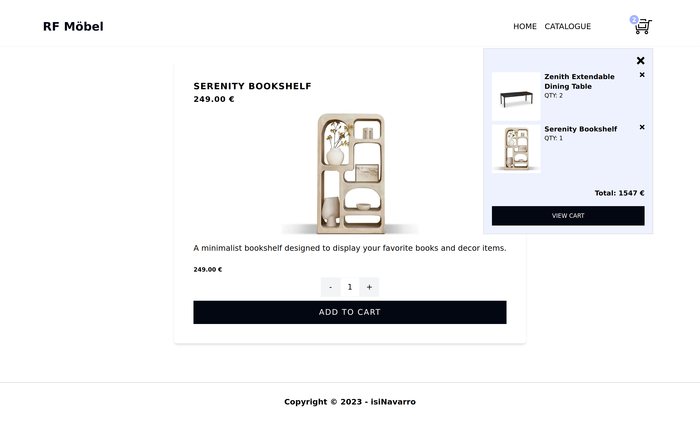

<h1 align="center" id="title">RF Möbel | Minimalism furniture</h1>

This was the final React project from The Odin Project's JavaScript curriculum. The main goal of this project was to build a fake e-commerce store using React and more specifically, react-router-dom. The fake store website consists of three main parts: Home, Catalogue, an "about" Product section and a Shopping Cart to display the items the user would like to purchase.

<h2>🚀 Live Demo</h2>

[https://isinavarro-odin-shopping-cart.netlify.app/](https://isinavarro-odin-shopping-cart.netlify.app/)

<h2>Project Screenshots:</h2>

<h2>🧐 Features</h2>

Here're some of the project's features:

- Add, remove and change the quantity of products from the shopping cart.
- Filter products by different categories

<h2>💻 Built with</h2>

Technologies used in the project:

- React JS
- TailwindCSS
- react-router-dom
